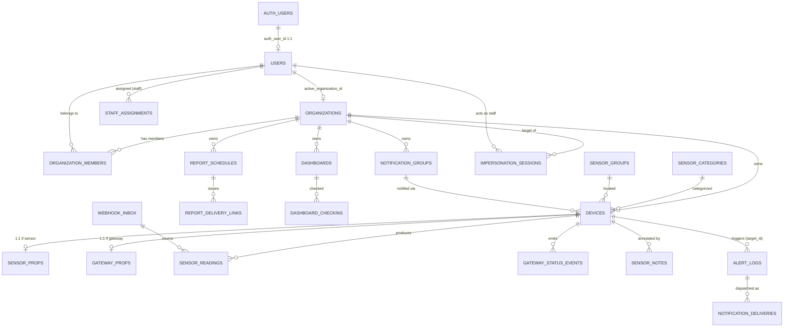
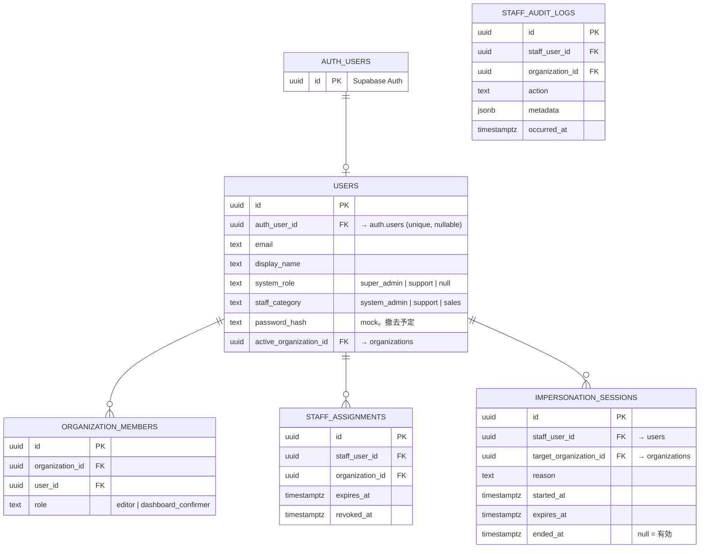

# ミテルデ — データベース設計ドキュメント

> Supabase（Postgres）への移行は**完了済み**。本書は **実 DB スキーマ（stg
> `bejgwwhxntnxzwehsryx` で検証した最終形）** を真値とし、β-2 確定設計と
> 今後の開発計画を反映したリファレンス。新規 migration を起こす際の基準。

最終更新: 2026-05-16  
対象: migration 0001〜0040 適用済み + β-2a/b/c（auth 統合の土台）

> ⚠ 注意:
> - **真値は実 DB**。乖離を見つけたら `mcp list_tables` で確認し本書を直す。
> - `0028`（manual_*）はローカルにファイルがあるが **dev/stg 未適用の欠番**。
>   オンラインマニュアルは未実装（将来対応、§10 参照）。
> - 認証は当初 Clerk 想定だったが **Supabase Auth 採用に確定**（β-2、§2）。

---

## 1. 設計方針

| 原則 | 内容 |
|---|---|
| マルチテナント | ほぼ全業務テーブルに `organization_id`。RLS で組織分離（現状は暫定、β-1 で JWT claim ベースに厳格化） |
| 認証 | **Supabase Auth**（email+password）。`users.auth_user_id` で `auth.users` と紐付け。Custom Access Token Hook が JWT に `app_role`/`org_id`/`impersonating_org_id`/`app_user_id` を注入 |
| 生データ保持 | Webhook 受信は `webhook_inbox` に raw 保管 → 加工して `sensor_readings` 等へ |
| JSONB 内包 | 当初テーブル分割予定だったものを実装では JSONB に内包: `dashboards.widgets` / `dashboard_checkins.sensor_comments` / `notification_groups.channels` / `*.alert_settings` / `*.thresholds` / `*.approval` |
| スナップショット | 削除可能な参照は `*_snapshot` 列で名称保持 |
| 時系列 | `sensor_readings` は `bigint identity`。将来 partition 候補 |
| 論理削除 | `organizations` は `deactivated_at` + `physical_delete_after`（180日猶予）方式 |

### 命名規則
- snake_case。PK `id uuid default gen_random_uuid()`（時系列のみ `bigint identity`）
- タイムスタンプ: `created_at` / `updated_at` default `now()`
- FK: `<table>_id`

---

## 2. 認証・ロール体系（Supabase Auth — β-2 確定）

### 2.1 構成

```
auth.users (Supabase Auth)
   └─ users.auth_user_id で 1:1 紐付け（users.id は不変、FK カスケード回避）

users.system_role                    — システム横断
   ├ 'super_admin'  全テナント、/admin 全機能
   ├ 'support'      割当テナントのみ（impersonation 必須）
   └ null           顧客ユーザー
users.staff_category                 — スタッフ細分（'system_admin'|'support'|'sales'）
users.active_organization_id         — 顧客の現アクティブテナント（複数所属時の切替対象）

organization_members.role            — テナント内
   ├ 'editor'              全機能
   └ 'dashboard_confirmer' ダッシュボード閲覧 + 確認記録のみ
```

### 2.2 Custom Access Token Hook（`public.custom_access_token_hook`、0039）

ログイン/リフレッシュ時に JWT の `app_metadata` へ注入（`SECURITY DEFINER`、
`impersonation_sessions` の RLS をバイパスして読む）:

| claim | 内容 |
|---|---|
| `app_user_id` | 内部 `users.id` |
| `app_role` | super_admin / support / editor / dashboard_confirmer / guest |
| `org_id` | 顧客の `active_organization_id`（無ければ所属先頭） |
| `impersonating_org_id` | 有効な `impersonation_sessions` があれば target org |

### 2.3 impersonation（A 方式 = custom claim）

`impersonation_sessions` に行を作り `refreshSession()` で JWT を再発行 →
`impersonating_org_id` claim が乗る。終了は `ended_at` をセットして再発行。
監査は `staff_audit_logs`。期限は `expires_at`（Hook が `ended_at is null
and expires_at > now()` で有効判定）。

### 2.4 マルチテナント切替（B1 方式）

`users.active_organization_id` を更新 → `refreshSession()` で `org_id`
claim を差し替える。

### 2.5 公開URL

- レポート: `report_delivery_links.token`（UUID、`expires_at` 90日失効、
  `share-report` 相当の閲覧ビューが期限検証）
- ダッシュボード: `dashboards.public_share_token` + `share-dashboard`
  Edge Function（service_role でホワイトリスト返却）

> mock 認証（`mock-login` Edge Function + `users.password_hash` SHA-256）は
> β-2 完了時に撤去予定。現状 dev は mock 温存（退避路）。

---

## 3. ER 図

### 3.1 全体（主要）



> `dashboards.widgets` / `dashboard_checkins.sensor_comments` /
> `notification_groups.channels` は **JSONB 内包**（独立テーブルなし）。

### 3.2 認証ドメイン



---

## 4. テーブル定義（ドメイン別・実 DDL）

> 実 DB の最終形。`create table` は要点を抜粋（default/check は実値）。

### 4.1 Tenancy & Auth

#### `organizations`
```sql
create table organizations (
  id uuid primary key default gen_random_uuid(),
  name text not null,
  slug text unique not null,
  plan text default 'demo',
  -- 契約メタ（Admin Console 用、0025）
  billing_cycle text check (billing_cycle in ('monthly','annual')),
  contract_started_at timestamptz,
  contract_expires_at timestamptz,
  payment_method text check (payment_method in ('bank_transfer','credit_card')),
  billing_email text,
  auto_invoice boolean,
  contract_type text check (contract_type in ('demo','subscription','purchase','typeless')),
  tsukurude_ai_enabled boolean,
  -- 論理削除（0027）
  deactivated_at timestamptz,
  deactivated_by_user_id uuid references users on delete set null,
  deactivation_reason text,
  physical_delete_after timestamptz,
  created_at timestamptz default now(),
  updated_at timestamptz default now()
);
```

#### `users`
```sql
create table users (
  id uuid primary key default gen_random_uuid(),
  clerk_user_id text unique,                 -- 旧 Clerk 想定。未使用
  email text not null unique,
  display_name text not null,
  system_role text check (system_role in ('super_admin','support')),  -- null=顧客
  staff_category text check (staff_category in ('system_admin','support','sales')),
  password_hash text,                        -- mock 認証(SHA-256)。撤去予定
  auth_user_id uuid unique references auth.users(id) on delete set null,  -- β-2
  active_organization_id uuid references organizations on delete set null, -- β-2
  created_at timestamptz default now(),
  updated_at timestamptz default now()
);
```

#### `organization_members`
```sql
create table organization_members (
  id uuid primary key default gen_random_uuid(),
  organization_id uuid not null references organizations on delete cascade,
  user_id uuid not null references users on delete cascade,
  role text not null check (role in ('editor','dashboard_confirmer')),
  invited_at timestamptz not null default now(),
  first_login_at timestamptz,
  last_login_at timestamptz,
  unique (organization_id, user_id)
);
```

#### `staff_assignments`
```sql
create table staff_assignments (
  id uuid primary key default gen_random_uuid(),
  staff_user_id uuid not null references users on delete cascade,
  organization_id uuid not null references organizations on delete cascade,
  granted_by_user_id uuid references users on delete set null,
  granted_at timestamptz not null default now(),
  expires_at timestamptz,
  revoked_at timestamptz,
  notes text
);
```

#### `staff_audit_logs`
```sql
create table staff_audit_logs (
  id uuid primary key default gen_random_uuid(),
  staff_user_id uuid references users on delete set null,
  organization_id uuid references organizations on delete set null,
  action text not null,                      -- 'impersonation_started'/'_ended' 等
  target_table text,
  target_id text,
  metadata jsonb default '{}',
  occurred_at timestamptz not null default now()
);
```
> localStorage には保持しない（容量保全）。Supabase 専用 + AdminAuditView が
> `fetchAuditLogsList` で都度取得。

#### `impersonation_sessions`（β-2、A 方式）
```sql
create table impersonation_sessions (
  id uuid primary key default gen_random_uuid(),
  staff_user_id uuid not null references users on delete cascade,
  target_organization_id uuid not null references organizations on delete cascade,
  reason text not null,
  started_at timestamptz not null default now(),
  expires_at timestamptz not null,
  ended_at timestamptz,                      -- null = 有効
  created_at timestamptz default now()
);
-- RLS 有効・ポリシー無し（anon/authenticated 不可、service_role/Hook のみ）
```

### 4.2 Settings（テナント単位マスタ）

#### `manufacturer_integrations`
```sql
create table manufacturer_integrations (
  id uuid primary key default gen_random_uuid(),
  organization_id uuid not null references organizations on delete cascade,
  manufacturer text not null,
  enabled boolean default false,
  webhook_secret text,
  webhook_uuid text,
  sensor_kinds text[] default '{}',
  config jsonb default '{}',
  unique (organization_id, manufacturer)
);
```

#### `notification_groups`（channels は JSONB 内包）
```sql
create table notification_groups (
  id uuid primary key default gen_random_uuid(),
  organization_id uuid not null references organizations on delete cascade,
  name text not null,
  timing text not null default 'immediate'
    check (timing in ('immediate','batch-1h','batch-6h','batch-12h','batch-24h')),
  enabled boolean default true,
  description text,
  channels jsonb default '[]',  -- [{kind:'email'|'slack'|'webhook', target, label?}]
  unique (organization_id, name)
);
```

#### `sensor_categories` / `sensor_groups`
```sql
create table sensor_categories (
  id uuid primary key default gen_random_uuid(),
  organization_id uuid not null references organizations on delete cascade,
  name text not null, icon text, description text,
  display_order int default 0,
  unique (organization_id, name)
);
create table sensor_groups (
  id uuid primary key default gen_random_uuid(),
  organization_id uuid not null references organizations on delete cascade,
  name text not null, description text, color text,
  display_order int default 0,
  unique (organization_id, name)
);
```

#### `report_schedules`（0034）
```sql
create table report_schedules (
  id uuid primary key default gen_random_uuid(),
  organization_id uuid not null references organizations on delete cascade,
  name text not null,
  enabled boolean not null default true,
  report_kind text not null check (report_kind in ('weekly','monthly')),
  target_sensor_ids uuid[] not null default '{}',
  notification_group_id uuid references notification_groups on delete set null,
  delivery_time text not null default '09:00',
  weekly_day_of_week int check (weekly_day_of_week between 0 and 6),
  monthly_day_of_month int check (monthly_day_of_month between 1 and 28),
  last_dispatched_period_key text,
  last_dispatched_at timestamptz,
  created_at timestamptz not null default now(),
  updated_at timestamptz not null default now()
);
```

### 4.3 Devices（Class Table Inheritance）

#### `devices`（共通マスター）
```sql
create table devices (
  id uuid primary key default gen_random_uuid(),
  organization_id uuid not null references organizations on delete cascade,
  device_type text not null check (device_type in ('sensor','gateway')),
  role text not null,                        -- temperature-humidity / master / relay …
  manufacturer text not null,
  model text not null,
  external_key text not null,                -- Webhook 照合キー
  serial_number text not null,
  dev_eui text,
  name text,
  device_number text not null,
  category_id uuid references sensor_categories on delete set null,
  group_id uuid references sensor_groups on delete set null,
  tags text[] default '{}',
  notification_group_id uuid references notification_groups on delete set null,
  online boolean default false,
  last_seen_at timestamptz,
  registered_at timestamptz default now(),
  metadata jsonb default '{}',
  created_at timestamptz default now(),
  updated_at timestamptz default now(),
  unique (organization_id, manufacturer, external_key)
);
```

#### `sensor_props`（device_type=sensor、1:1）
```sql
create table sensor_props (
  device_id uuid primary key references devices on delete cascade,
  gateway_id uuid references devices on delete set null,  -- 親機（自己参照）
  thresholds jsonb,
  battery int check (battery between 0 and 100),
  alert_settings jsonb not null default
    '{"offlineEnabled":true,"offlineThresholdMinutes":60,"deviationEnabled":true,
      "deviationConsecutiveCount":3,"batteryEnabled":false,"batteryThresholdPercent":10,
      "notifyChannels":{"email":true,"slack":false,"push":false}}',
  exclusion_windows jsonb default '[]',
  exclusion_dates jsonb default '[]',
  created_at timestamptz default now(),
  updated_at timestamptz default now()
);
```

#### `gateway_props`（device_type=gateway、1:1）
```sql
create table gateway_props (
  device_id uuid primary key references devices on delete cascade,
  alert_settings jsonb not null default
    '{"offlineEnabled":true,"offlineThresholdMinutes":60,
      "notifyChannels":{"email":true,"slack":false,"push":false}}',
  exclusion_windows jsonb default '[]',
  exclusion_dates jsonb default '[]',
  created_at timestamptz default now(),
  updated_at timestamptz default now()
);
```

#### `sensor_notes`（approval は JSONB 内包）
```sql
create table sensor_notes (
  id uuid primary key default gen_random_uuid(),
  organization_id uuid not null references organizations on delete cascade,
  sensor_id uuid references devices on delete set null,
  sensor_name_snapshot text not null,
  author_id text not null,                   -- mock の userId（text）
  author_name text not null,
  body text not null,
  category text not null check (category in
    ('install','move','calibration','maintenance','config','incident','other')),
  approval jsonb,                            -- 承認情報を内包
  timestamp timestamptz not null default now(),
  created_at timestamptz default now()
);
```

#### Webhook 照合
`(organization_id, manufacturer, external_key)` で `devices` を引き、
`device_type` に応じ `sensor_props`/`gateway_props` を更新。Milesight は
`external_key = devEUI`。

### 4.4 Dashboards（widgets / sensor_comments は JSONB 内包）

#### `dashboards`
```sql
create table dashboards (
  id uuid primary key default gen_random_uuid(),
  organization_id uuid not null references organizations on delete cascade,
  name text not null,
  description text,
  target_sensor_ids uuid[] default '{}',
  default_period jsonb not null default '{"type":"week"}',
  widgets jsonb not null default '[]',       -- ウィジェットを内包（別テーブルなし）
  public_share_token text,                   -- 公開URL用
  public_share_issued_at timestamptz,
  display_order int default 0,
  created_at timestamptz default now(),
  updated_at timestamptz default now()
);
-- public_share_token は部分 unique index
```

#### `dashboard_checkins`
```sql
create table dashboard_checkins (
  id uuid primary key default gen_random_uuid(),
  organization_id uuid not null references organizations on delete cascade,
  dashboard_id uuid references dashboards on delete set null,
  dashboard_name_snapshot text not null,
  user_id text not null,                     -- mock userId（text）
  user_name text not null,
  timestamp timestamptz not null default now(),
  status text check (status in ('no-issue','has-issue')),
  comment text,
  sensor_comments jsonb default '[]',        -- センサー別コメントを内包
  snapshot jsonb not null default '{}',      -- 確認時点のスナップショット
  approval jsonb,
  created_at timestamptz default now()
);
```

### 4.5 Data / Logs（時系列）

#### `webhook_inbox`
```sql
create table webhook_inbox (
  id uuid primary key default gen_random_uuid(),
  organization_id uuid references organizations on delete cascade,
  manufacturer text not null,
  received_at timestamptz default now(),
  source_ip inet,
  signature_valid boolean,
  payload_raw jsonb not null,
  event_id text,
  idempotency_key text not null,             -- (org_id, idempotency_key) で冪等
  request_headers jsonb,
  raw_body text,
  parse_status text default 'pending'
    check (parse_status in ('pending','parsed','failed','ignored','unmatched')),
  parse_error text,
  parsed_at timestamptz,
  parsed_reading_count int,
  created_at timestamptz default now(),
  unique (organization_id, idempotency_key)
);
```

#### `sensor_readings`
```sql
create table sensor_readings (
  id bigint generated always as identity primary key,
  organization_id uuid not null references organizations on delete cascade,
  sensor_id uuid not null references devices on delete cascade,
  measured_at timestamptz not null,
  temperature numeric,
  humidity numeric,
  battery int,
  source_inbox_id uuid references webhook_inbox on delete set null,
  inserted_at timestamptz default now()
);
-- idx: (sensor_id, measured_at desc), (organization_id, measured_at desc)
-- 最新値は RPC get_latest_readings（DISTINCT ON、§7）で取得（C1 対策）
```

#### `gateway_status_events`
```sql
create table gateway_status_events (
  id uuid primary key default gen_random_uuid(),
  organization_id uuid not null references organizations on delete cascade,
  gateway_id uuid not null references devices on delete cascade,
  occurred_at timestamptz default now(),
  status text check (status in ('online','offline')),
  source text                                -- heartbeat / webhook / manual
);
```

#### `alert_logs`（target_id 単一参照、session 管理付き）
```sql
create table alert_logs (
  id uuid primary key default gen_random_uuid(),
  organization_id uuid not null references organizations on delete cascade,
  occurred_at timestamptz not null,
  target_kind text not null check (target_kind in ('sensor','gateway')),
  target_id uuid references devices on delete set null,  -- sensor/gateway 共通
  manufacturer text not null,
  model text not null,
  serial_number text not null,
  sensor_number text,
  kind text not null check (kind in
    ('deviation-alert','deviation-warn','offline','offline-recovery','battery')),
  metric text check (metric in ('temperature','humidity','battery')),
  value numeric,
  message text not null,
  confirm_comment text,
  confirmed_by text,
  confirmed_at timestamptz,
  session_id uuid,                           -- 連続逸脱セッション（0029）
  re_alert_index integer not null default 0, -- 再アラート回数
  created_at timestamptz default now()
);
-- idx: (org, occurred_at desc), (target_id, occurred_at desc),
--      (session_id), (org, target_id, kind, metric, occurred_at desc)
```
> 通知ステータスは `alert_logs` に持たず **`notification_deliveries`** で管理。

#### `notification_deliveries`（0031、通知配信履歴）
```sql
create table notification_deliveries (
  id uuid primary key default gen_random_uuid(),
  organization_id uuid not null references organizations on delete cascade,
  alert_log_id uuid not null references alert_logs on delete cascade,
  notification_group_id uuid references notification_groups on delete set null,
  channel_kind text not null check (channel_kind in ('email','slack','webhook')),
  target text not null,
  status text not null default 'pending'
    check (status in ('pending','sent','failed','skipped')),
  scheduled_for timestamptz not null default now(),  -- timing で遅延設定
  attempted_at timestamptz,
  sent_at timestamptz,
  error_message text,
  retry_count integer not null default 0,    -- 上限5、超で failed 固定
  provider_message_id text,                  -- Resend message id 等
  created_at timestamptz not null default now()
);
-- idx: (status, scheduled_for) where pending / (alert_log_id) / (org, created_at desc)
```

#### `report_delivery_links`（0034、レポート公開リンク）
```sql
create table report_delivery_links (
  id uuid primary key default gen_random_uuid(),
  organization_id uuid not null references organizations on delete cascade,
  schedule_id uuid not null references report_schedules on delete cascade,
  token uuid not null unique default gen_random_uuid(),
  report_kind text not null check (report_kind in ('weekly','monthly')),
  period_start date not null,
  period_end date not null,
  target_sensor_ids uuid[] not null default '{}',
  expires_at timestamptz,                    -- 発行から90日（恒久露出対策）
  last_viewed_at timestamptz,
  view_count integer not null default 0,
  created_at timestamptz not null default now()
);
```

---

## 5. RLS 方針

### 5.1 現状（暫定 — β-1 で全面置換予定）

- `demo_select` / `demo_update` / `demo_insert` / `demo_delete`:
  `organization_id = public.demo_org_id()`（固定 demo org）で anon に開放
- `admin_full`: 14+ テーブルで `for all to anon, authenticated using(true)`
  （Admin Console 用の暫定全開放）
- `webhook_inbox select tmp` 等の `*_tmp` ポリシー
- `impersonation_sessions`: RLS 有効・**ポリシー無し**（service_role / Hook のみ）

### 5.2 β-1 で実装する標準ポリシー（計画）

Custom Access Token Hook が JWT に `org_id` / `impersonating_org_id` /
`app_role` を載せている前提で、各業務テーブルを置換:

```sql
create policy "<table> access"
  on <table> for all
  using (
    organization_id = coalesce(
      (auth.jwt() -> 'app_metadata' ->> 'impersonating_org_id')::uuid,
      (auth.jwt() -> 'app_metadata' ->> 'org_id')::uuid
    )
    or (auth.jwt() -> 'app_metadata' ->> 'app_role') = 'super_admin'
  );
```

- 暫定 `admin_full` / `demo_*` / `*_tmp` を全廃
- `dashboard_confirmer` は書き込みを `dashboard_checkins` 等に限定
- 公開URL（report_delivery_links / dashboards.public_share_token）は
  Edge Function（service_role）でトークン検証してホワイトリスト返却

---

## 6. Edge Functions（Supabase / Deno）

| 関数 | 役割 | verify_jwt | トリガ |
|---|---|---|---|
| `webhook-milesight` | Milesight Webhook 受信 → inbox + inline parse | **false** | MDP HTTP POST |
| `parse-inbox` | webhook_inbox pending を一括処理 | true | pg_cron 10分 |
| `send-notification` | 単一 delivery を email/slack/webhook 送信 | true | dispatch から |
| `send-notification-test` | テスト送信（履歴に残さない） | true | UI 手動 |
| `dispatch-notifications` | pending deliveries を捌くワーカ | true | pg_cron 1分 |
| `dispatch-report-schedules` | レポート定期配信 | true | pg_cron 1分 |
| `detect-status-alerts` | オフライン検知/再アラート/復帰/バッテリ再 | true | pg_cron 10分 |
| `backfill-alerts` | 過去 readings から alert_logs 再生成 | true | 手動 |
| `mock-login` | mock 認証（撤去予定） | false | UI |
| `share-dashboard` | 公開ダッシュボード（トークン検証） | false | 公開URL |

共有モジュール: `_shared/alertDetection.ts`（連続逸脱判定）/
`_shared/modelMap.ts`（model→device_type、webhook-milesight↔parse-inbox 共通）/
`_shared/urlGuard.ts`（SSRF ガード、通知系3関数）。

### 6.1 RPC / Hook

- `public.custom_access_token_hook(jsonb)`（0039、SECURITY DEFINER）— §2.2
- `public.get_latest_readings(p_org_id uuid, p_sensor_ids uuid[])`（0040、
  SECURITY INVOKER）— 各センサー最新1行を DISTINCT ON で返す（C1 対策）
- `public.invoke_parse_inbox(int)`（0014/0015）— pg_cron から parse-inbox 起動
- `public.demo_org_id()` — 暫定 RLS 用の固定 demo org

### 6.2 pg_cron ジョブ（4本）

| jobname | schedule | 内容 |
|---|---|---|
| `parse-inbox-every-10min` | `*/10 * * * *` | invoke_parse_inbox |
| `dispatch-notifications-every-min` | `* * * * *` | dispatch-notifications |
| `dispatch-report-schedules-every-min` | `* * * * *` | dispatch-report-schedules |
| `detect-status-alerts-every-10min` | `*/10 * * * *` | detect-status-alerts |

> URL/anon JWT は環境ごとに異なる（migration ファイルは dev 値、stg/prod
> 適用時にスワップ）。将来環境変数化を検討。

---

## 7. データフロー

```
[Milesight Webhook] → webhook-milesight EF
   └→ webhook_inbox（生 payload、idempotency_key で冪等、500件チャンク upsert）
      └→ inline parse / parse-inbox(cron)
         ├→ devices online/last_seen_at 更新、sensor_props.battery 更新
         ├→ sensor_readings 追記（source_inbox_id 紐付け）
         └→ _shared/alertDetection: 連続逸脱判定 → alert_logs（session_id 管理）
            └→ notification_deliveries 生成（timing で scheduled_for）

detect-status-alerts(cron 10分)
   └→ devices ページング全件 + sensor_props → オフライン/復帰/バッテリ再
      → alert_logs + notification_deliveries

dispatch-notifications(cron 1分)
   └→ notification_deliveries pending を send-notification へ（retry≤5）
      → send-notification: email(Resend)/slack/webhook（urlGuard で SSRF 防御）

dispatch-report-schedules(cron 1分)
   └→ report_schedules を時刻判定 → report_delivery_links 発行（90日失効）
      → notification_groups の channels へ URL 配信

[ダッシュボード確認 UI] → dashboard_checkins（sensor_comments 内包）

[Supabase Auth ログイン] → custom_access_token_hook
   → JWT app_metadata に app_role/org_id/impersonating_org_id/app_user_id
```

---

## 8. テーブル一覧（実装済み 23 + auth.users）

| ドメイン | テーブル |
|---|---|
| Tenancy/Auth | `organizations`, `users`, `organization_members`, `staff_assignments`, `staff_audit_logs`, `impersonation_sessions`（+ `auth.users`） |
| Settings | `manufacturer_integrations`, `notification_groups`, `sensor_categories`, `sensor_groups`, `report_schedules` |
| Devices | `devices`, `sensor_props`, `gateway_props`, `sensor_notes` |
| Dashboards | `dashboards`, `dashboard_checkins` |
| Data/Logs | `webhook_inbox`, `sensor_readings`, `gateway_status_events`, `alert_logs`, `notification_deliveries`, `report_delivery_links` |

---

## 9. 実装進捗（β リリースロードマップと連動）

`docs/roadmap-beta-to-prod.md` が最新の正。要約:

- ✅ **β-0** stg 環境構築（migration 0001-0040 / Edge Functions / pg_cron）
- ✅ **β-3** Resend 独自ドメイン認証（noreply@miterude.cloud）
- ✅ **β-4** 3 プロジェクト構成（dev/stg/prod、dev/stg 稼働）
- 🔄 **β-2** Supabase Auth: a/b/c 完了（スキーマ/Hook/検証ユーザー）。
  次は β-2d（フロント改修）→ 2e/2f
- ✅ リファクタ第1弾（SSRF/レポート失効/ヘッダ/トークン/重複統合/デッドコード）
- ✅ リファクタ第2弾（C1 RPC / C2 チャンク / H1 ページング+並列）
- ⏳ **β-1** RLS 厳格化（§5.2、β-2 完了後）

---

## 10. 今後の開発 / 未実装テーブル backlog

### 10.1 今後の主要開発

- **β-2d-f**: フロントを `supabase.auth` へ（mock-login/password_hash 撤去）
- **β-1**: RLS を JWT claim ベースに全置換、暫定 policy 全廃
- **β-10 電話通知**: Twilio Programmable Voice + AWS Polly Neural。
  `notification_groups.channels` に voice 種別追加、`users.phone_e164`、
  `send-notification` の voice 対応、深夜抑制、月予算ガード

### 10.2 設計時想定したが未実装（必要時に追加）

| テーブル | 代替 / 状況 |
|---|---|
| `member_invitations` | β-8 で実装予定（招待フロー） |
| `widgets` | `dashboards.widgets` jsonb に内包済（テーブル化しない方針） |
| `dashboard_checkin_sensor_comments` / `_segment_comments` | `dashboard_checkins.sensor_comments` jsonb に内包 |
| `notification_channels` | `notification_groups.channels` jsonb に内包 |
| `dashboard_shares` / `dashboard_share_views` | `dashboards.public_share_token` + `share-dashboard` EF。閲覧解析は未実装 |
| `report_runs` | `report_delivery_links` に置換（PDF 生成でなく公開URL方式） |
| `notification_dispatches` | `notification_deliveries` に置換 |
| `threshold_templates` | 未実装（閾値はセンサー個別 `sensor_props.thresholds`） |
| `saved_filters` / `dashboard_reminders` | 未実装（必要時） |
| `manual_categories` / `manual_pages` | 0028 はローカルのみ・dev/stg 未適用。マニュアル機能は将来 |

---

## 11. 参考: 認証セッションの変遷

```
[mock 期] localStorage AuthSession（撤去予定）
  | { kind:'tenant', userId, organizationId }
  | { kind:'admin',  userId }
  | { kind:'impersonation', userId, actingAsOrganizationId, reason,
      startedAt, expiresAt }

      ↓ β-2（確定・移行中）

[Supabase Auth] supabase.auth.getSession() + JWT app_metadata
  app_user_id / app_role / org_id / impersonating_org_id
  - tenant 切替: users.active_organization_id 更新 + refreshSession()
  - impersonation: impersonation_sessions 行 + refreshSession()
  - RLS（β-1）: organization_id = coalesce(impersonating_org_id, org_id)
                or app_role = 'super_admin'
```
