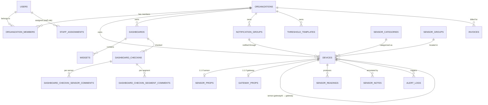
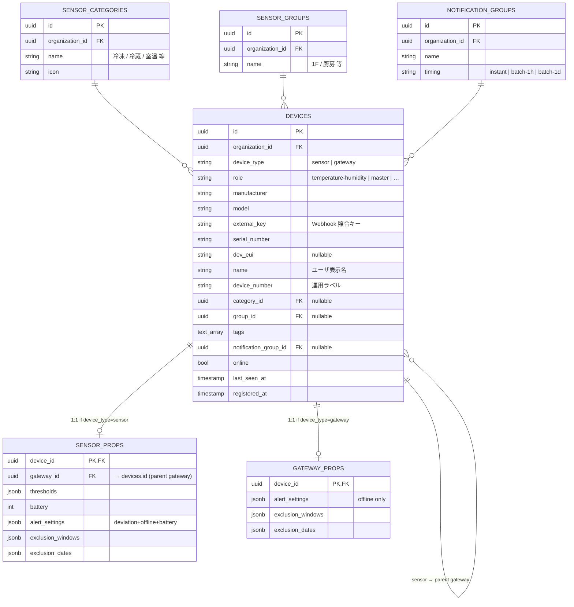
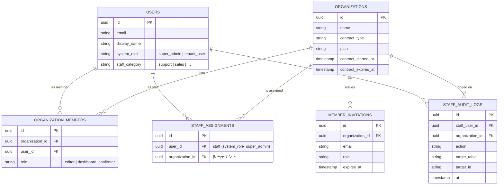
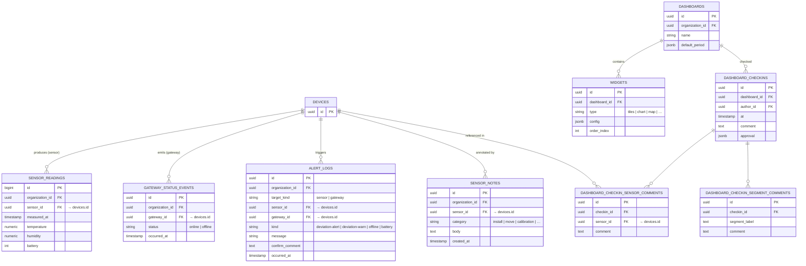
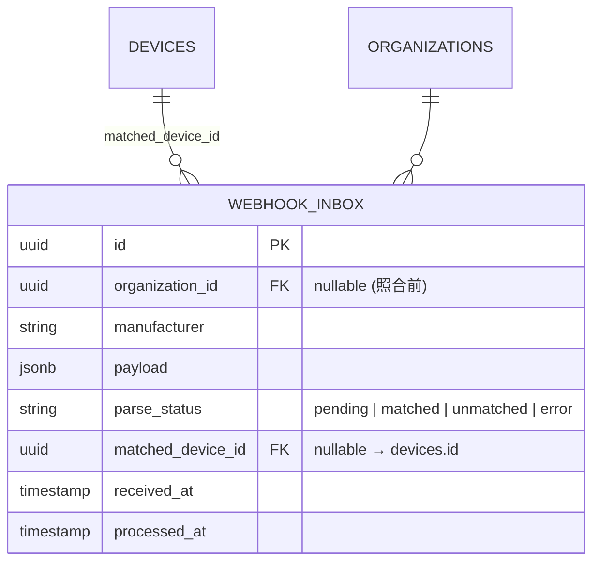

# ミテルデ — データベース設計ドキュメント

> Supabase（Postgres）への移行を前提とした、ミテルデ全体のスキーマ設計をまとめたもの。
> モック開発が完了したら本ドキュメントを基にマイグレーション SQL を起こす。

最終更新: 2026-05-08

---

## 1. 設計方針

| 原則 | 内容 |
|---|---|
| マルチテナント | ほぼすべての業務テーブルに `organization_id` を持たせ、Supabase の RLS で組織ごとに完全分離 |
| 認証 | Clerk と統合する想定で `users` を Clerk-mirrored にし、`organization_members` で多対多リレーション |
| 生データ保持 | Webhook 受信は `webhook_inbox` に raw 状態で残し、加工して `sensor_readings` 等のドメイン層へ流す |
| JSONB 活用 | 閾値・アラート設定・期間設定など可変な構造は JSONB で持つ |
| スナップショット | 削除可能な参照は `*_snapshot` 列で名前を保管し、履歴の可読性を維持 |
| 時系列 | `sensor_readings` は `bigint identity` で大量レコード対応。将来 partitioning 候補 |

### 命名規則

- スネークケース（snake_case）で全テーブル・カラム
- タイムスタンプ: `created_at`, `updated_at` (default `now()`)
- 必要なら `deleted_at timestamptz` で論理削除
- PK: `id uuid` with `gen_random_uuid()`（時系列のみ `bigint identity`）
- FK: `<table>_id`（例: `sensor_id`, `organization_id`）

---

## 2. 認証・ロール体系

### 2.1 ロールの 4 階層

```
■ users.system_role                       — システム横断
   ├ 'super_admin'  全テナントアクセス、/admin の全機能
   ├ 'support'      割り当てテナントのみ（impersonation 必須）
   └ null           顧客ユーザー

■ organization_members.role               — テナント内
   ├ 'editor'              全機能（既存）
   └ 'dashboard_confirmer' ダッシュボード閲覧 + 確認記録のみ
```

| ロール | できること | 制限 |
|---|---|---|
| `super_admin` | 全テナント常時アクセス、/admin 全機能、テナント作成、スタッフ追加 | impersonation で顧客 UI を見るときは監査ログ必須 |
| `support` | 割り当て済みテナントのみ、impersonation で入室 | 監査ログ必須、有効期限あり |
| `editor` | テナント内の全機能 | 自テナントのみ |
| `dashboard_confirmer` | ダッシュボード閲覧 + 確認記録（Checkin） | センサー詳細・設定・メンバー管理は不可 |

### 2.2 公開URL（補助的なアクセス手段）

- ログインなしで読み取り専用閲覧が可能
- 確認記録は残せない（残したい場合は `dashboard_confirmer` ロールを発行）
- パスワード保護・有効期限を設定可能
- 各アクセスはオプションで `dashboard_share_views` に記録

---

## 3. ER 図（図解）

> Mermaid 形式で記述してあるので、GitHub の Markdown ビューや VS Code の Mermaid プレビューで自動レンダリングされる。
> カーディナリティ記号: `||` 必須 1、`o|` 任意 1（0 or 1）、`}o`/`}{` 0+/1+ 多。

### 3.1 全体像（主要テーブルだけ）



### 3.2 Devices ドメイン（Phase F-4 統合後の中核）



**ポイント**:
- `devices` 1 テーブルに sensor も gateway も並ぶ（`device_type` で区別）
- `sensor_props` / `gateway_props` は `devices` への 1:1 拡張テーブル（マップキー = device_id）
- センサーから親機への参照 `sensor_props.gateway_id` も `devices.id` を指す（自己参照）
- Webhook 照合は `(organization_id, manufacturer, external_key)` の複合一意キー

### 3.3 認証・ロール ドメイン



### 3.4 運用・ログ ドメイン（Dashboards / Alerts / Readings）



### 3.5 Webhook 受信ドメイン（生データの一時保管）



**Webhook 受信フロー**:
1. メーカーから POST 受信 → `webhook_inbox` に生 payload を保存（status=pending）
2. ワーカが `(manufacturer, external_key)` で `devices` を引き、ヒットすれば status=matched + matched_device_id を埋める
3. matched なら `device_type` に応じて `sensor_props` / `gateway_props` を更新、`sensor_readings` / `gateway_status_events` に時系列を追記
4. 未マッチは status=unmatched で残し、admin 画面で手動マッピング可能にする

---

## 4. テーブル一覧（ドメイン別）

### 4.1 Tenancy & Auth

#### `organizations`
```sql
create table organizations (
  id uuid primary key default gen_random_uuid(),
  name text not null,
  slug text unique not null,
  plan text default 'demo',
  created_at timestamptz default now(),
  updated_at timestamptz default now()
);
```

#### `users`
```sql
create table users (
  id uuid primary key default gen_random_uuid(),
  clerk_user_id text unique,                -- Clerk 統合時に紐付け（モック期は null）
  email text unique not null,
  display_name text,
  system_role text check (system_role in ('super_admin','support')),
  -- null = 顧客ユーザー
  created_at timestamptz default now(),
  updated_at timestamptz default now()
);
```

#### `organization_members`
```sql
create table organization_members (
  id uuid primary key default gen_random_uuid(),
  organization_id uuid not null references organizations on delete cascade,
  user_id uuid not null references users on delete cascade,
  role text not null check (role in ('editor','dashboard_confirmer')),
  invited_at timestamptz default now(),
  joined_at timestamptz,
  unique (organization_id, user_id)
);
```

#### `member_invitations`
```sql
create table member_invitations (
  id uuid primary key default gen_random_uuid(),
  organization_id uuid not null references organizations on delete cascade,
  email text not null,
  role text not null check (role in ('editor','dashboard_confirmer')) default 'editor',
  invited_by_user_id uuid references users,
  token text unique not null,
  expires_at timestamptz not null,
  accepted_at timestamptz,
  accepted_by_user_id uuid references users,
  created_at timestamptz default now()
);
create index on member_invitations (organization_id);
create index on member_invitations (email);
```

#### `staff_assignments`
サポートスタッフが特定テナントへアクセスできる権限の割り当て。スーパーアドミンには不要。

```sql
create table staff_assignments (
  id uuid primary key default gen_random_uuid(),
  staff_user_id uuid not null references users on delete cascade,
  organization_id uuid not null references organizations on delete cascade,
  granted_by_user_id uuid references users,
  granted_at timestamptz default now(),
  expires_at timestamptz,
  revoked_at timestamptz,
  notes text,
  created_at timestamptz default now(),
  unique (staff_user_id, organization_id)
);
create index on staff_assignments (staff_user_id) where revoked_at is null;
create index on staff_assignments (organization_id) where revoked_at is null;
```

#### `staff_audit_logs`
```sql
create table staff_audit_logs (
  id uuid primary key default gen_random_uuid(),
  staff_user_id uuid not null references users,
  organization_id uuid references organizations,
  action text not null,                    -- 'enter-tenant'/'view'/'edit'/'create-org'/'add-staff' など
  target_table text,
  target_id uuid,
  ip_address inet,
  user_agent text,
  metadata jsonb default '{}',
  occurred_at timestamptz default now()
);
create index on staff_audit_logs (staff_user_id, occurred_at desc);
create index on staff_audit_logs (organization_id, occurred_at desc);
create index on staff_audit_logs (action, occurred_at desc);
```

#### `manual_categories` / `manual_pages`
オンラインマニュアル（全テナント共通）。super_admin のみ編集可、テナントユーザーは閲覧のみ。

```sql
create table manual_categories (
  id uuid primary key default gen_random_uuid(),
  name text not null,
  sort_order integer not null default 0,
  updated_at timestamptz default now()
);

create table manual_pages (
  id uuid primary key default gen_random_uuid(),
  category_id uuid not null references manual_categories on delete cascade,
  title text not null,
  sort_order integer not null default 0,
  content jsonb,                 -- BlockNote の Block[] を JSON で保持
  updated_by_user_id uuid references users,
  updated_at timestamptz default now()
);
create index on manual_pages (category_id, sort_order);
```

---

### 4.2 Settings（テナント単位のマスタ）

| テーブル | 役割 | 主要カラム |
|---|---|---|
| `manufacturer_integrations` | Milesight / IoT Mobile 連携 | `manufacturer`, `enabled`, `webhook_secret`, `sensor_kinds[]`, `config jsonb` |
| `notification_groups` | 通知グループ | `name`, `timing`（即時/1h/6h/12h/24h まとめ） |
| `notification_channels` | グループ配下の宛先 | `notification_group_id` FK, `kind`(email/slack/webhook), `target` |
| `threshold_templates` | 閾値テンプレ | `name`, `description`, `thresholds jsonb` |
| `sensor_categories` | 区分マスタ | `name`, `icon`, `color` |
| `sensor_groups` | グループマスタ | `name` |
| `saved_filters` | 保存フィルタ | `user_id`(個人 or 共有), `conditions jsonb` |
| `report_schedules` | レポート定期配信 | `report_kind`(週/月), `target_sensor_ids uuid[]`, `notification_group_id`, `delivery_time`, `weekly_day_of_week`, `monthly_day_of_month` |
| `dashboard_reminders` | 確認リマインド | `dashboard_id`(null=全部), `frequency`, `deadline_time`, `weekly_day_of_week`, `notification_group_id` |

すべて `organization_id` を持つ。

---

### 4.3 Devices

> **Phase F-4 (Block D) 改訂**: センサーとゲートウェイを 1 つの `devices` マスターに
> 統合し、固有プロパティは `sensor_props` / `gateway_props` で持つ
> Class Table Inheritance 構造に変更。Webhook 受信時は (manufacturer, external_key) で
> `devices` を引き、`device_type` に応じて props 側を更新する。

#### `devices`（共通マスター）
すべてのデバイス（センサー / ゲートウェイ / 中継機）が 1 行ずつ並ぶマスター。
共通プロパティ（識別子・分類・状態）はここで完結。固有のセンサー値や閾値は
`sensor_props` / `gateway_props` に分けて持つ。

```sql
create table devices (
  id uuid primary key default gen_random_uuid(),
  organization_id uuid not null references organizations on delete cascade,

  -- ============================================
  -- 外部識別（メーカーが決める、不変）
  -- ============================================
  device_type text not null check (device_type in ('sensor','gateway')),
  -- model からほぼ決まる具体的な役割。
  -- sensor: 'temperature-humidity' | 'temperature' | 'current' | 'co2' | 'pressure' | 'door' | 'other'
  -- gateway: 'master' | 'relay'
  role text not null,
  manufacturer text not null,            -- 'Milesight', 'IoT Mobile', ...
  model text not null,                   -- 'EM320-TH', 'AM102', 'UG65', ...
  -- メーカー発行の一意キー。Webhook 受信時の照合に使う。
  -- 値の中身はメーカーごとに異なる（Milesight: devEUI、その他: serial_number 等）。
  external_key text not null,
  serial_number text not null,           -- 製造シリアル（参考表示用）
  dev_eui text,                          -- LoRaWAN 識別子（無いメーカーもある）

  -- ============================================
  -- 表示・分類（ユーザー運用上設定）
  -- ============================================
  name text,
  device_number text not null,           -- 'DV-001', '厨房-冷凍-01' 等の運用ラベル
  category_id uuid references sensor_categories on delete set null,  -- 運用区分（冷凍/冷蔵/室温）
  group_id uuid references sensor_groups on delete set null,         -- 設置場所
  tags text[] default '{}',
  notification_group_id uuid references notification_groups on delete set null,

  -- ============================================
  -- システム管理（自動更新）
  -- ============================================
  online boolean default false,
  last_seen_at timestamptz,
  registered_at timestamptz default now(),
  metadata jsonb default '{}',
  created_at timestamptz default now(),
  updated_at timestamptz default now(),

  -- 一意性: メーカー + external_key の組で 1 デバイス
  unique (organization_id, manufacturer, external_key)
);
create index on devices (organization_id);
create index on devices (device_type);
create index on devices (organization_id, manufacturer, external_key);
```

#### `sensor_props`（センサー固有プロパティ、devices と 1:1）
`device_type='sensor'` のレコードに対する 1:1 の延長テーブル。

```sql
create table sensor_props (
  device_id uuid primary key references devices on delete cascade,
  -- 接続先ゲートウェイ（同じ devices テーブルへの自己参照）
  gateway_id uuid references devices,
  -- 個別の逸脱判定閾値（kind に応じた構造を JSONB で保持）
  thresholds jsonb,
  battery int check (battery between 0 and 100),
  -- アラート設定: deviation / offline / battery を含む
  alert_settings jsonb not null default '{
    "offlineEnabled": true,
    "offlineThresholdMinutes": 60,
    "deviationEnabled": true,
    "deviationConsecutiveCount": 3,
    "batteryEnabled": false,
    "batteryThresholdPercent": 10,
    "notifyChannels": {"email": true, "slack": false, "push": false}
  }',
  -- 通知抑制（時間帯 / 特定日付）。配列型 JSONB。
  exclusion_windows jsonb default '[]',
  exclusion_dates jsonb default '[]',
  created_at timestamptz default now(),
  updated_at timestamptz default now()
);
create index on sensor_props (gateway_id);
```

#### `gateway_props`（ゲートウェイ固有プロパティ、devices と 1:1）
`device_type='gateway'` のレコードに対する 1:1 の延長テーブル。
温湿度の閾値判定もバッテリーも持たないため、アラート発火条件はオフラインのみ。

```sql
create table gateway_props (
  device_id uuid primary key references devices on delete cascade,
  -- アラート設定: offline のみ
  alert_settings jsonb not null default '{
    "offlineEnabled": true,
    "offlineThresholdMinutes": 60,
    "notifyChannels": {"email": true, "slack": false, "push": false}
  }',
  exclusion_windows jsonb default '[]',
  exclusion_dates jsonb default '[]',
  created_at timestamptz default now(),
  updated_at timestamptz default now()
);
```

#### Webhook 受信時の照合フロー
メーカーごとの統合モジュール（`/webhook/<manufacturer>` エンドポイント）は、
ペイロードから「そのメーカーが採用している一意キー」を抽出する:

| メーカー | external_key の中身 | ペイロードフィールド例 |
|---|---|---|
| Milesight | devEUI（16字HEX） | `payload.devEUI` |
| Sensirion | serialNumber | `payload.serial` |
| 自社開発 | 独自 ID | （メーカー仕様による） |

照合手順:
```sql
-- 1) (organization_id, manufacturer, external_key) で devices を引く
select * from devices
where organization_id = $1
  and manufacturer = 'Milesight'
  and external_key = '24E124785D190657';
-- 2) 見つかった device.device_type に応じて sensor_props / gateway_props を更新
update sensor_props
set battery = $1, updated_at = now()
where device_id = $2;
update devices
set last_seen_at = now(), online = true
where id = $2;
```

#### UI 上の View（オプション、参考）
既存コードの利便性のため、JOIN 済みのビューを提供してもよい:
```sql
-- センサー JOIN ビュー（旧 sensors テーブル相当）
create view sensors_v as
  select d.*, sp.gateway_id, sp.thresholds, sp.battery, sp.alert_settings,
         sp.exclusion_windows, sp.exclusion_dates
  from devices d
  join sensor_props sp on sp.device_id = d.id
  where d.device_type = 'sensor';

-- ゲートウェイ JOIN ビュー
create view gateways_v as
  select d.*, gp.alert_settings, gp.exclusion_windows, gp.exclusion_dates
  from devices d
  join gateway_props gp on gp.device_id = d.id
  where d.device_type = 'gateway';
```

#### `sensor_notes` — 運用メモ
> Phase F-4 改訂: `sensor_id` は `devices(id)` を参照（device_type='sensor' 想定）。

```sql
create table sensor_notes (
  id uuid primary key default gen_random_uuid(),
  organization_id uuid not null references organizations on delete cascade,
  sensor_id uuid not null references devices on delete cascade,
  sensor_name_snapshot text not null,
  author_id uuid references users,
  author_name_snapshot text not null,
  body text not null,
  category text not null check (category in (
    'install','move','calibration','maintenance','config','incident','other'
  )),
  approved_by_id uuid references users,
  approved_by_name_snapshot text,
  approved_at timestamptz,
  approval_comment text,
  created_at timestamptz default now()
);
create index on sensor_notes (organization_id, sensor_id);
```

---

### 4.4 Dashboards & Widgets

#### `dashboards`
```sql
create table dashboards (
  id uuid primary key default gen_random_uuid(),
  organization_id uuid not null references organizations on delete cascade,
  name text not null,
  description text,
  target_sensor_ids uuid[] default '{}',
  default_period jsonb default '{"type":"week"}',
  display_order int default 0,
  created_at timestamptz default now(),
  updated_at timestamptz default now()
);
```

#### `widgets`
```sql
create table widgets (
  id uuid primary key default gen_random_uuid(),
  dashboard_id uuid not null references dashboards on delete cascade,
  type text not null check (type in ('tiles','chart','floormap','deviation-pickup')),
  title text not null,
  span text default 'half' check (span in ('half','full')),
  display_order int not null default 0,
  config jsonb not null default '{}',
  target_sensor_ids uuid[] default null,         -- null = ダッシュボード全体
  created_at timestamptz default now(),
  updated_at timestamptz default now()
);
create index on widgets (dashboard_id, display_order);
```

#### `dashboard_checkins`
```sql
create table dashboard_checkins (
  id uuid primary key default gen_random_uuid(),
  organization_id uuid not null references organizations on delete cascade,
  dashboard_id uuid references dashboards on delete set null,
  dashboard_name_snapshot text not null,
  user_id uuid references users,
  user_name_snapshot text not null,
  status text check (status in ('no-issue','has-issue')),
  comment text,
  sensor_count int,
  online_count int,
  deviation_sensor_count int,
  lookback_hours int,
  period_label text,
  range_start timestamptz,
  range_end timestamptz,
  approved_by_id uuid references users,
  approved_by_name_snapshot text,
  approved_at timestamptz,
  approval_comment text,
  timestamp timestamptz not null default now(),
  created_at timestamptz default now()
);
```

#### `dashboard_checkin_sensor_comments`
```sql
create table dashboard_checkin_sensor_comments (
  id uuid primary key default gen_random_uuid(),
  checkin_id uuid not null references dashboard_checkins on delete cascade,
  sensor_id uuid references devices on delete set null,
  sensor_name_snapshot text not null,
  deviation_kinds text[] default '{}',
  detected_temp numeric,
  detected_hum numeric,
  comment text,
  created_at timestamptz default now()
);
create index on dashboard_checkin_sensor_comments (checkin_id);
```

#### `dashboard_checkin_segment_comments`
```sql
create table dashboard_checkin_segment_comments (
  id uuid primary key default gen_random_uuid(),
  sensor_comment_id uuid not null references dashboard_checkin_sensor_comments on delete cascade,
  metric text check (metric in ('temperature','humidity')),
  direction text check (direction in ('above','below','mixed')),
  start_at timestamptz not null,
  end_at timestamptz not null,
  slot_count int,
  extreme_value numeric,
  comment text,
  created_at timestamptz default now()
);
create index on dashboard_checkin_segment_comments (sensor_comment_id);
```

---

### 4.5 Public Dashboard Sharing

#### `dashboard_shares`
```sql
create table dashboard_shares (
  id uuid primary key default gen_random_uuid(),
  organization_id uuid not null references organizations on delete cascade,
  dashboard_id uuid not null references dashboards on delete cascade,
  public_token text not null,
  title text,
  allow_period_change boolean default true,
  allow_checkin boolean default false,
  password_hash text,
  expires_at timestamptz,
  revoked_at timestamptz,
  created_by_user_id uuid references users,
  view_count int default 0,
  last_viewed_at timestamptz,
  created_at timestamptz default now(),
  updated_at timestamptz default now()
);
create unique index on dashboard_shares (public_token) where revoked_at is null;
```

#### `dashboard_share_views`（任意・推奨）
```sql
create table dashboard_share_views (
  id uuid primary key default gen_random_uuid(),
  share_id uuid not null references dashboard_shares on delete cascade,
  viewed_at timestamptz default now(),
  ip_address inet,
  user_agent text,
  visitor_hash text                          -- IP + UA + day を sha256
);
create index on dashboard_share_views (share_id, viewed_at desc);
```

---

### 4.6 Data / Logs（時系列）

#### `webhook_inbox`
```sql
create table webhook_inbox (
  id uuid primary key default gen_random_uuid(),
  organization_id uuid references organizations on delete cascade,  -- 不正受信は null 可
  manufacturer text not null,
  received_at timestamptz default now(),
  source_ip inet,
  signature_valid boolean,
  payload_raw jsonb not null,
  parse_status text default 'pending' check (parse_status in (
    'pending','parsed','failed','ignored'
  )),
  parse_error text,
  parsed_at timestamptz,
  parsed_reading_count int,
  created_at timestamptz default now()
);
create index on webhook_inbox (received_at desc);
create index on webhook_inbox (organization_id, received_at desc);
```

#### `sensor_readings`
```sql
create table sensor_readings (
  id bigint generated always as identity primary key,
  organization_id uuid not null references organizations on delete cascade,
  sensor_id uuid not null references devices on delete cascade,
  measured_at timestamptz not null,
  temperature numeric,
  humidity numeric,
  battery int,
  source_inbox_id uuid references webhook_inbox on delete set null,
  inserted_at timestamptz default now()
);
create index on sensor_readings (sensor_id, measured_at desc);
create index on sensor_readings (organization_id, measured_at desc);
-- 大量データを想定する場合: partition by range (measured_at)
```

#### `gateway_status_events`
```sql
create table gateway_status_events (
  id uuid primary key default gen_random_uuid(),
  organization_id uuid not null references organizations on delete cascade,
  gateway_id uuid not null references devices on delete cascade,
  occurred_at timestamptz default now(),
  status text check (status in ('online','offline')),
  source text                                -- 'heartbeat' / 'webhook' / 'manual'
);
create index on gateway_status_events (gateway_id, occurred_at desc);
```

#### `alert_logs`
```sql
create table alert_logs (
  id uuid primary key default gen_random_uuid(),
  organization_id uuid not null references organizations on delete cascade,
  occurred_at timestamptz not null,
  target_kind text not null check (target_kind in ('sensor','gateway')),
  -- 統合後は単一の target_device_id を使う方が整合的だが、既存コードとの互換のため両方残す。
  -- どちらも devices(id) を参照する（target_kind で区別）。
  sensor_id uuid references devices on delete set null,
  gateway_id uuid references devices on delete set null,
  manufacturer_snapshot text not null,
  model_snapshot text not null,
  serial_number_snapshot text not null,
  sensor_number_snapshot text,
  kind text not null check (kind in ('deviation-alert','deviation-warn','offline','battery')),
  metric text check (metric in ('temperature','humidity','battery')),
  value numeric,
  message text not null,
  -- ダッシュ確認時の連携メモ
  confirm_comment text,
  confirmed_by_id uuid references users,
  confirmed_by_name_snapshot text,
  confirmed_at timestamptz,
  -- 通知ステータス
  notification_status text default 'pending' check (notification_status in (
    'pending','sent','suppressed','failed'
  )),
  notified_at timestamptz,
  created_at timestamptz default now(),
  unique (organization_id, target_kind, sensor_id, gateway_id, kind, metric, occurred_at)
);
create index on alert_logs (organization_id, occurred_at desc);
create index on alert_logs (sensor_id, occurred_at desc);
```

#### `report_runs`
```sql
create table report_runs (
  id uuid primary key default gen_random_uuid(),
  organization_id uuid not null references organizations on delete cascade,
  schedule_id uuid references report_schedules on delete set null,
  report_kind text not null check (report_kind in ('weekly','monthly')),
  period_start date not null,
  period_end date not null,
  target_sensor_ids uuid[] not null,
  storage_path text,                         -- Supabase Storage 内の PDF パス
  status text default 'pending' check (status in (
    'pending','generating','completed','failed'
  )),
  failure_reason text,
  triggered_by uuid references users,
  created_at timestamptz default now(),
  completed_at timestamptz
);
```

#### `notification_dispatches`
```sql
create table notification_dispatches (
  id uuid primary key default gen_random_uuid(),
  organization_id uuid not null references organizations on delete cascade,
  notification_group_id uuid references notification_groups on delete set null,
  channel_kind text not null check (channel_kind in ('email','slack','webhook')),
  target text not null,
  trigger_kind text not null check (trigger_kind in (
    'alert-batch','report','dashboard-reminder'
  )),
  alert_log_ids uuid[] default '{}',
  report_run_id uuid references report_runs,
  reminder_id uuid references dashboard_reminders,
  status text default 'pending' check (status in ('pending','sent','failed')),
  failure_reason text,
  subject text,
  body_preview text,
  sent_at timestamptz,
  created_at timestamptz default now()
);
create index on notification_dispatches (organization_id, created_at desc);
```

---

## 5. RLS（Row Level Security）方針

### 5.1 ヘルパ関数
```sql
create or replace function public.acting_organization_id() returns uuid
language sql stable as $$
  select nullif(auth.jwt() ->> 'acting_as_organization_id', '')::uuid;
$$;

create or replace function public.current_user_system_role() returns text
language sql stable as $$
  select system_role from users where id = auth.uid();
$$;
```

### 5.2 標準ポリシー（ほぼすべての業務テーブルに適用）

```sql
create policy "<table> access policy"
  on <table> for all
  using (
    -- 1) 顧客メンバー: 所属組織のみ
    organization_id in (
      select organization_id from organization_members
      where user_id = auth.uid()
    )
    or
    -- 2) スーパーアドミン: 常時すべてアクセス可
    current_user_system_role() = 'super_admin'
    or
    -- 3) サポートスタッフ: 割当があり、かつ impersonation 中のみ
    (
      current_user_system_role() = 'support'
      and organization_id = acting_organization_id()
      and exists (
        select 1 from staff_assignments
        where staff_user_id = auth.uid()
          and organization_id = acting_organization_id()
          and revoked_at is null
          and (expires_at is null or expires_at > now())
      )
    )
  );
```

### 5.3 `dashboard_confirmer` 用ポリシー
基本的にはサイドメニュー / UI 側で出し分け（ダッシュボード関連のみアクセス可）。
書き込みポリシーは `dashboard_checkins` 等のみに `editor or dashboard_confirmer` を許可、
それ以外のテーブルへの書き込みは `editor` のみ。

```sql
-- 例: dashboard_checkins の書き込み
create policy "dashboard_checkins write"
  on dashboard_checkins for insert
  with check (
    organization_id in (
      select om.organization_id from organization_members om
      where om.user_id = auth.uid()
        and om.role in ('editor','dashboard_confirmer')
    )
    or current_user_system_role() = 'super_admin'
    -- support は impersonation 中のみ。略
  );

-- 例: sensors の書き込み（confirmer は不可）
create policy "sensors write"
  on sensors for insert
  with check (
    organization_id in (
      select om.organization_id from organization_members om
      where om.user_id = auth.uid() and om.role = 'editor'
    )
    or current_user_system_role() = 'super_admin'
  );
```

### 5.4 公開URL（dashboard_shares）からのアクセス
- Edge Function（service_role）でトークン検証 → 必要なデータだけホワイトリスト形式で返却
- RLS をバイパスするため、Edge Function 側で必ずアクセス制御（token + revoked_at + expires_at）

### 5.5 Webhook 受信
- Edge Function が service_role で `webhook_inbox` に挿入
- パース結果も同様に service_role で書き込み

---

## 6. データフロー全体像

```
[Milesight Webhook]
        │
        ▼
[webhook_inbox]                   ← 生データを常に保管
        │
        ▼ Edge Function: parse
        ├─→ [sensors] online/battery/last_seen_at を更新
        ├─→ [sensor_readings] 時系列追加
        └─→ [gateway_status_events] 遷移時に追加
        │
        ▼ DB Trigger / Edge Function: 判定
        │
        └─→ [alert_logs] 閾値・オフライン・バッテリー判定で追加

[Cron: 通知ディスパッチャ (1h/6h/...)]
        │
        ▼ alert_logs.notification_status='pending' を SELECT
        ├─→ メール / Slack / Webhook 配信
        └─→ [notification_dispatches] に履歴 + alert_logs 状態更新

[ダッシュボード確認 (UI)]
        │
        ▼
[dashboard_checkins] + [..._sensor_comments] + [..._segment_comments]
        │
        ▼ App ロジック
        │
        └─→ 該当期間の [alert_logs] へ confirm_comment を書き戻し

[レポート定期配信 (Cron)]
        │
        ▼ report_schedules を時刻でトリガ
        ├─→ [report_runs] status=generating
        ├─→ Storage に PDF 保管 → storage_path 更新
        ├─→ status=completed
        └─→ [notification_dispatches] にレポート通知履歴
```

---

## 7. テーブル一覧サマリ（合計 26 テーブル）

| ドメイン | テーブル |
|---|---|
| Tenancy / Auth | `organizations`, `users`, `organization_members`, `member_invitations`, `staff_assignments`, `staff_audit_logs` |
| Settings | `manufacturer_integrations`, `notification_groups`, `notification_channels`, `threshold_templates`, `sensor_categories`, `sensor_groups`, `saved_filters`, `report_schedules`, `dashboard_reminders` |
| Devices | `devices`, `sensor_props`, `gateway_props`, `sensor_notes` |
| Dashboards | `dashboards`, `widgets`, `dashboard_checkins`, `dashboard_checkin_sensor_comments`, `dashboard_checkin_segment_comments` |
| Public Sharing | `dashboard_shares`, `dashboard_share_views` |
| Data / Logs | `webhook_inbox`, `sensor_readings`, `gateway_status_events`, `alert_logs`, `report_runs`, `notification_dispatches` |

---

## 8. 実装フェーズ

| Phase | 範囲 | 期待される動作 |
|---|---|---|
| **A** | /admin モック構築（localStorage） | マルチテナント対応 + スタッフ管理 + 監査ログのモック |
| B | TypeScript 型を最終形に整理 | Supabase スキーマと 1:1 マッピング |
| C | Supabase スキーマ + RLS + Edge Functions | マイグレーション SQL を流し込み |
| D | 認証層（Clerk + Supabase JWT） | Clerk セッション → users.clerk_user_id 紐付け |
| E | ドメイン別に逐次置換（マスタ → デバイス → 時系列） | localStorage を Supabase クエリへ |
| F | Webhook 受信 → webhook_inbox の Edge Function 構築 | 実データ取り込み |
| G | アラート判定 / レポート生成 / 通知配信の自動化（Cron） | 完全 SaaS 動作 |

### 8.1 Phase A の詳細サブステップ

| ステップ | 内容 |
|---|---|
| A-1 | マルチテナント対応 localStorage 構造への移行 + 認証セッション型導入 |
| A-2 | コンテキスト選択画面 + ユーザーメニューに「切り替え」追加 |
| A-3 | `dashboard_confirmer` ロールの UI 反映（サイドメニュー出し分け / 編集ボタン非表示） |
| A-4 | `/admin/tenants` テナント一覧・作成・詳細 |
| A-5 | `/admin/staff` スタッフ管理 + 割り当て + impersonation |
| A-6 | テナント側で「サポートで閲覧中」警告バー |
| A-7 | `/admin/audit` 監査ログ閲覧 |

---

## 9. 検討余地（将来のオプション）

1. **`sensors.online` を保持 vs 都度算出**
   - 現状: 保持。`last_seen_at` のみで「N 分以上前ならオフライン」と算出する設計も可
2. **`alert_logs` の量**
   - テナント次第で月数十万行も想定 → 日付パーティショニング推奨
   - Supabase の `pg_cron` で 12 ヶ月超のパーティションをコールド保管する運用検討
3. **Clerk 統合タイミング**
   - モック期: `users.email` だけで運用
   - Clerk 接続時: `clerk_user_id` をマッピング、`auth.uid()` が Clerk JWT の `sub` と一致するよう Supabase の JWT カスタマイズを設定
4. **マスタ系のシード**
   - `sensor_categories`, `notification_groups` の既定値（冷蔵 / 冷凍 / 常温 など）はテナント作成時に seed function でコピー投入
5. **Public URL のアクセス分析**
   - `dashboard_share_views` を集計して「先月この公開URLは何人に何回見られたか」を顧客に提示
6. **dashboard_confirmer 細分化**
   - 必要になれば `dashboard_confirmer_assignments(user_id, dashboard_id)` で特定ダッシュボードのみ閲覧可とする運用も追加可能

---

## 10. 参考: 認証セッションのデータ形（モック期）

```ts
type AuthSession =
  | { kind: 'tenant', userId: string, organizationId: string }
  | { kind: 'admin',  userId: string }                         // スーパーアドミンが /admin にいる
  | { kind: 'impersonation',                                   // スタッフが顧客 UI を見ている
      userId: string,
      actingAsOrganizationId: string,
      reason: string,
      startedAt: Date,
      expiresAt: Date }
```

Supabase 統合時は Clerk JWT に `acting_as_organization_id` カスタムクレームを乗せ、
RLS ヘルパ関数 `acting_organization_id()` が読む。
